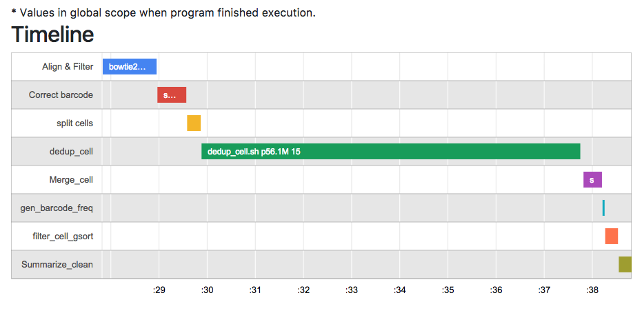

Single-cell / single nuclei ATAC-seq  pipeline 
===================================================

**scATAC** is made of following steps:

0. decomplex scATAC-seq data by scATAC_debarcode [OPTIONAL];
1. map using bowtie2 followed by filtering reads with MAPQ < 30; (*currently using bowtie2*)
2. correct barcode error caused by sequencing error by allowing certain number of mismatches [2];
3. split reads to individual cells based on the barcode combination;
4. remove PCR duplication for each cell; (*currently using `samtools rmdup`)
6. merge reads from different cells;
7. generate barcode frequency table;
8. filter cells with reads counts less than given number [500];
9. summerize and generate a log file;


!!! **For the old version of the shell scripts, check the legend README [here](./README_legend.md).** Below is the use of this pipeline wrappered using bigdatascript (bds) language. 

# Installation
## For tscc user

No installation is necessary. The dependent softwares and libs are installed in a conda enrionment that can directly be loaded. 
Add the following into your `~/.bashrc`. Then `. ~/.bashrc` and test by using `scATAC.bds -help`, 

```bash
export PATH=/usr/lib/jvm/java-1.8.0-openjdk-1.8.0.31-1.b13.el6_6.x86_64/bin:$PATH
export PATH="$PATH:/projects/ps-epigen/software/miniconda3/bin/"
export _JAVA_OPTIONS="-Xms256M -Xmx728M -XX:ParallelGCThreads=1"
export PATH="$PATH:/projects/ps-epigen/software/.bds/"
export PATH="$PATH:/projects/ps-epigen/software/scATAC/bin"
export PICARDROOT="/projects/ps-epigen/software/miniconda3/envs/bds_atac/share/picard-1.126-4/"
```
## For other user 
1. Install conda: check https://github.com/kundajelab/atac_dnase_pipelines#conda
2. install bds: check https://github.com/kundajelab/atac_dnase_pipelines#bigdatascript
3. Run `bash ./install_dependencies.sh` to generate `bds_scATAC` environment to encapsulate dependent softwares. 
    
# Usage 
``` shell
$ scATAC.bds -help
Picked up _JAVA_OPTIONS: -Xms256M -Xmx728M -XX:ParallelGCThreads=1
== scATAC pipeline settings
	-barcode_dir <string>        : folder that contains r7_ATAC, i7_ATAC, i5_ATAC and r5_ATAC barcode.
	-bowtie2_idx <string>        : Bowtie2 indexed reference genome.
	-mark_duplicate <string>     : path to picard MarkDuplicates.jar [MarkDuplicates.jar].
	-max_barcode_mismatch <int>  : max barcode mismatch allowed for barcode error correction [2].
	-min_read <int>              : cells with reads less than 'min_read' will be filtered [500].
	-prefix <string>             : prefix of output files.
	-r1 <string>                 : fastq.gz file that contains forward reads (only .gz allowed).
	-r2 <string>                 : fastq.gz file that contains reverse reads (only .gz allowed).
	-threads <int>               : Set threads for Bowtie2 mapping, sorting and duplication removal [1].
```

## For tscc user 
Check the `pbs` files in the `\examples` folder. 

## Input 
Currently it run start from the fastq files after decomplex and demultiplex. 


## Output 
* scATAC generates two files '.log' and '.bam'. '.bam' is the final file that contains all usable reads and '.log' includes data metrics.
* Also, pipeline will generate a report html named like `scATAC.bds.20171028_022747_846.report.*`. It contains all the information about your run. 
# Features

* Timeline for running. An example timeline in your report: 
* Detailed reports on each steps, including cmd, input, output and stderr and etc.   
* Resume from last failed point just rerun the script. 

# Licence
MIT


